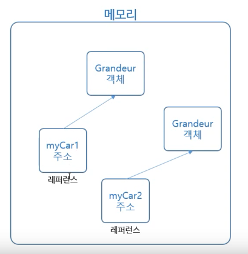

# week01

# 11-2 객체란?

세상에 존재하느 모든 것을 뜻하며, 프로그래밍에서 속성과 기능을 가지는 프로그램 단위 

객체를 생성하기 위한 틀로 모든 객체는 클래스로부터 생성된다.

# 11-3 클래스 구성요소?

속성(멤버 변수): 안장, 핸들, 바구니, 기어 

기능(메서드): 기어 변속, 가속, 브레이크

생성자

```java
public class Grandeur {
    
    public String color;
    public String gear;
    public int price;

    //생성자
    public Grandeur(){
        System.out.println("Grandeur constructor");
    }
	
    public void run(){
        System.out.println("---run---");

    }

    public void stop(){
        System.out.println("---stop----");
    }
```

# 12-2  객체를 생성

```
public static void main(String[] args) {

    SpringApplication.run(Week01Application.class,args);

//클래스로 부터 "new"를 이용하여 객체를 생성한다.
    Grandeur myCar = new Grandeur();
myCar.run();
}
```

객체의 메모리 주소를 변수myCare에 담는 것. 레퍼런스에 객체가 있는 것이 아니다!



# 13-1 메서드 선언과 호출


메서드도 변수와 같이 선언 및 정의 후 필요시에 호출해서 사용한다. 

# 13-4 접근자

메서드를 호출할 때 접근자에 따라서 호출이 불가할 수 있다.


private  접근자는 객체 내부에서 사용 할 수 있다. 

# 14-1 메모리에서 객체 생성(동적 생성)


클래스를 통해 객체가 메모리에 동적으로 생성된다. 객체는 별도의 메모리 공간에 생성되어 있고 객체가 생성된 메모리 주소값만 레퍼런스에 들어 있다. 
제거의 과정을 설명하자면, 우선 객체가 가리키는 레퍼런스를 제거한다.  메모리에 떠도는 인자 없는 (주소가 없는) 객체들을 GC가 메모리를 돌면서 회수한다. 

*레퍼런스(가리킨다) : 생성한 객체의 주소를 변수에 저장하는 것을 레퍼런스라고 한다.* 


레퍼런스에 null을 집어 넣을 수 있다. (주의! 레퍼런스가 사라지는게 아니다.)

null을 가리키는 레퍼런스를 호출하면 Execption 발생(NullPointException).

# 15-1 디폴트 생성자


# 15-2 사용자 정의 생성자 

디폴트 생성자 외에 특정 목적에 의해서 개발자가 만든 생성자로, 매개변수에 차이가 있다. 


# 15-3 소멸자

객체가 GC에 의해서 메모리에서 제거될 때 finalize() 메서드가 호출된다. 

`System.gc();` : GC 실행 명령 

주의! GC가 바로 작동하는 것이 아니라, 가급적 빨리 작동하도록 요청하는 것이다. 

java는 기본적으로 메모리를 개발자가 직접 관리하지 않으므로 일반적으로 `System.gc();`를 사용하는 경우는 드물다.


# 16-3 static

클래스의 속성과 메서드에 static 키워드를 사용하면 어디서나 속성과 메서드를 공유할 수 있다.

 


parkBank와 leeBank 는 같은 클래스의 각 각 다른 객체지만 static 변수 amount만은 공유한다.  

# 17-1 멤버 변수 private 설정

멤버 변수(속성)는 주로 private으로 설정해서, 외부로부터 데이터가 변질되는 것을 막는다.


# 17-2 setter, getter

멤버 변수를 외부에 변경할 수 있도록 하는 메서드이다.


 name은 setter,getter 만들지 않았으므로 name은 변경할 수 없다.

*굳이 setter, getter을 쓰는 이유?*  
*위 코드를 보면 setScore을 통해 score 값이 50을 넘어야 setter의 기능을 할 수 있다. 안전장치(?)의 역할을 해준다.*
